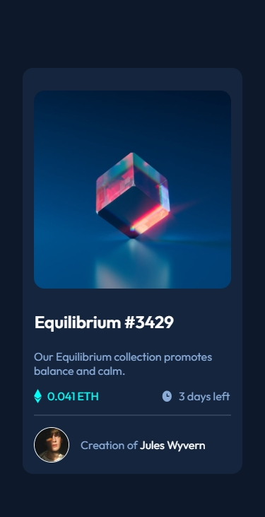

# Frontend Mentor - NFT preview card component solution

This is a solution to the [NFT preview card component challenge on Frontend Mentor](https://www.frontendmentor.io/challenges/nft-preview-card-component-SbdUL_w0U). Frontend Mentor challenges help you improve your coding skills by building realistic projects. 

## Table of contents

- [Overview](#overview)
  - [The challenge](#the-challenge)
  - [Screenshot](#screenshot)
  - [Links](#links)
- [My process](#my-process)
  - [Built with](#built-with)
  - [What I learned](#what-i-learned)
  - [Continued development](#continued-development)
  - [Useful resources](#useful-resources)
- [Author](#author)
- [Acknowledgments](#acknowledgments)

## Overview

### The challenge

Users should be able to:

- View the optimal layout depending on their device's screen size
- See hover states for interactive elements

### Screenshot

### Links

- Solution URL: [Github Repo](https://github.com/sedaryildirim/NFT-preview-card-component)
- Live Site URL: [Github Pages](https://sedaryildirim.github.io/NFT-preview-card-component/)

## My process

Had a lot of trouble with this challenge, mainly due to the fact that it was my first time
overlaying an image onto another one - everything worked locally with responsively / live server
however completly broke upon hitting github pages - took a break after 6 hours troubleshooting,
had some sleepand came back restarted from scratch and focused on getting the img effect to work before anything else and managed to finish in 120mins roughly.

### Built with

- HTML5 
- CSS custom properties
- CSS Grid
- Flexbox
- Mobile-first workflow
- BEM naming structure
- SCSS

### What I learned

How to overlay images on others, BEM naming structure (think i got it now)

### Continued development

### Useful resources

- [Grid Lay It Out](https://grid.layoutit.com/) - Grid layouts & positioning

## Author

- Website - [Sedar Yildirim](https://github.com/sedaryildirim)
- Frontend Mentor - [@sedaryildirim](https://www.frontendmentor.io/profile/sedaryildirim)
- Twitter - [@Sdry85](https://www.twitter.com/sdry85)

## Acknowledgments

- [Frontendmentor.io](https://www.frontendmentor.io/)

